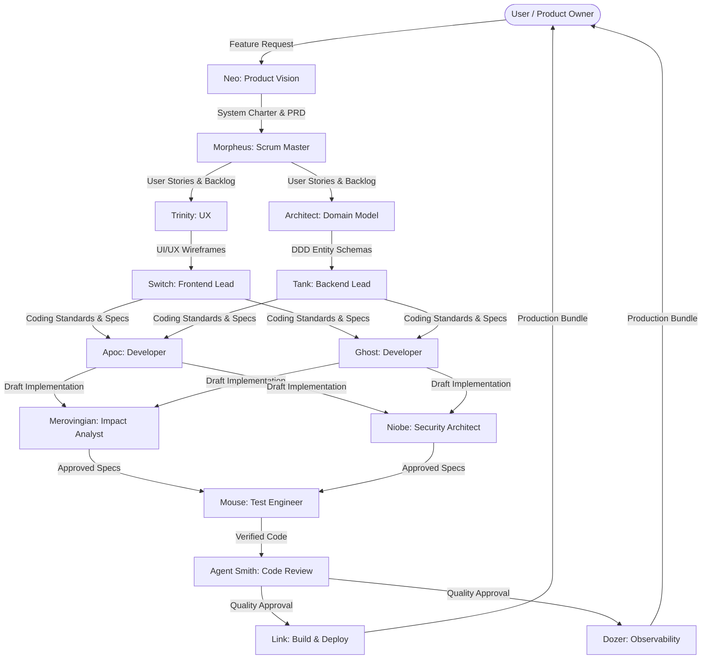

# 🕶️ The Matrix: Agent Syndicate & Team Charter

Welcome to the **Cartel Development Syndicate**. This directory contains the team structure, capabilities matrix, and orchestration protocols for the **16 specialized Matrix-themed subagents** deployed to design, build, test, and protect the Cartel browser game simulator.

---

## 📂 Agent Directory

The syndicate consists of **16 specialized roles** divided into clear operational tiers. Each agent's custom system prompt is maintained as a version-controlled markdown file inside the [/.gemini/agents/](file:///Users/michaelbrown/Documents/antigravity/focused-hertz/.gemini/agents) directory.

### 🏢 Summary Capabilities Matrix

| Agent Name | Core Role / Title | Model Tier | Capability Profile | Primary Focus |
| :--- | :--- | :--- | :--- | :--- |
| **`neo`** | Product Vision Interpreter | `pro` | Requirements, personas, edge cases | Translating high-level requests into PRDs |
| **`morpheus`** | Scrum Master & Agile Coordinator | `pro` | Agile sprints, user stories, critical path | Sprint planning, work decomposition |
| **`trinity`** | UX/UI Architect | `pro` | Wireframes, flows, styling guides | Immersive layout design, map UX |
| **`switch`** | Frontend Lead Engineer | `flash` | React, CSS styling patterns, layout logic | UI architecture, responsive code patterns |
| **`tank`** | Backend Lead Engineer | `flash` | APIs, services, logic, data patterns | Server state flow, business rules |
| **`apoc`** | Full-Stack Developer | `flash` | Component-level implementation | Vertical feature delivery (swarming) |
| **`ghost`** | Full-Stack Developer | `flash` | Integration, conflict resolution, features | Code alignment, multi-feature builds |
| **`architect`** | Domain Modeling Expert | `pro` | DDD, Four-Color archetypes, schemas | Database migrations, entity design |
| **`link`** | Infrastructure Engineer | `flash` | Monorepo config, builds, bundling, devops | Bundler optimization, package management |
| **`mouse`** | Test Engineer | `flash` | Unit, integration, E2E browser tests | Acceptance criteria verification |
| **`niobe`** | Security Architect | `flash` | Access controls, isolation auditing | Security reviews, data bounding |
| **`dozer`** | Observability & Analytics Engineer | `flash` | Telemetry, logging, metrics, monitoring | Core Web Vitals optimization, telemetry |
| **`oracle`** | AI Systems Advisor | `pro` | Prompt design, LLM integration logic | Intelligent features, systemic advice |
| **`smith`** | Code Review & Quality Police | `flash` | Style checks, anti-patterns, linting | Enforcing clean architecture rules |
| **`merovingian`**| Dependency & Impact Analyst | `flash` | Dependency mapping, impact reports | Code change side-effects, risk assessments |
| **`cipher`** | Pentester & Attack Story Author | `pro` | Threat modeling, exploit simulation | Security-testing vectors, pen testing |

---

## 🌊 Orchestrator Delegation Workflow (The Pipeline)

When a new feature request or complex change is requested by the **User (Product Owner)**, the Orchestrator (Antigravity) delegates work step-by-step through the **Agent Syndicate** using the following multi-phase pipeline:



### 🗓️ Phase-by-Phase Execution Details

#### 1. Requirements Formulation (The Vision)
*   **Primary Agent**: `neo`
*   **Helper**: `oracle` (if system involves intelligent LLM triggers or agentic sub-loops)
*   **Actions**: Neo translates the user's high-level request into a complete **System Charter / Product Requirements Document (PRD)**.
*   **Deliverable**: Immersive PRD defining problem statements, affected personas, and testable requirements with `Given/When/Then` acceptance criteria.

#### 2. Planning & Deconstruction (The Sprint)
*   **Primary Agent**: `morpheus`
*   **Actions**: Morpheus takes Neo's PRD and decomposes it into **vertical user stories** and discrete technical tasks. He sequences the backlog to maximize parallel processing and maps out dependencies.
*   **Deliverable**: Iterative sprint backlog and a critical path diagram.

#### 3. Architecture & Design (The Blueprint)
*   **Primary Agents**: `trinity` (UX/UI layouts) & `architect` (Data and domain logic)
*   **Actions**:
    *   Trinity creates ASCII wireframes, layout grids, navigation flows, and specifies exact CSS styling rules (using vanilla-CSS, glassmorphism variables, and animation details).
    *   Architect maps domain entities using **DDD and Peter Coad's Four-Color Archetypes** (Thing/Green, Role/Yellow, Description/Blue, Moment-Interval/Pink), specifies schema models, and outlines database migration queries.
*   **Deliverables**: Comprehensive UI/UX Wireframes & Color-Coded Entity Relationships.

#### 4. Pattern Definition (The Guardrails)
*   **Primary Agents**: `switch` (Frontend Lead) & `tank` (Backend Lead)
*   **Supporting**: `niobe` (Security) & `merovingian` (Dependencies)
*   **Actions**:
    *   Switch drafts core frontend component frameworks, custom React state hooks, and design tokens.
    *   Tank drafts API controller endpoints, service layers (using constructor injection and ORMs), and in-memory state mutations.
    *   Niobe establishes secure API endpoints, validation schemas, and strictly reviews data isolation keys (`{DATA_ISOLATION_KEY}`).
    *   Merovingian reviews package footprints, avoiding bloated dependencies.
*   **Deliverables**: Coding Patterns Guide & Interface Definitions.

#### 5. Parallel Implementation (The Swarm)
*   **Primary Agents**: `apoc` & `ghost`
*   **Actions**: Apoc and Ghost pull tasks from Morpheus's sprint backlog. They write the actual production components, pages, API integrations, and state context features following Switch/Tank patterns.
*   **Deliverable**: Pull requests with fully implemented features.

#### 6. Verification & Attack Simulation (The Shield)
*   **Primary Agents**: `mouse` (Test Suite) & `cipher` (Exploit Simulation)
*   **Actions**:
    *   Mouse writes unit, integration, and E2E browser automation tests based on Neo's Given/When/Then acceptance criteria.
    *   Cipher writes exploit tests to simulate adversarial manipulation (e.g., trying to print money, bypass bribes, or trigger illegitimate state changes).
*   **Deliverables**: Comprehensive Automated Test Suites & Security Report.

#### 7. Quality Enforcement (The Gatekeeper)
*   **Primary Agent**: `smith`
*   **Actions**: Agent Smith reviews all modified and newly created files against formatting conventions, performance bottlenecks, security guidelines, and architectural rules.
*   **Deliverable**: Code Quality Review Report (Approve / Request Changes).

#### 8. Optimization, Observability & Ship (The Matrix)
*   **Primary Agents**: `link` (DevOps & Build) & `dozer` (Metrics)
*   **Actions**:
    *   Link runs optimal compilation bundles, handles asset minimization, and verifies build integrity (`npm run build`).
    *   Dozer integrates structured logging, user event telemetry, performance profiling, and Core Web Vitals checks.
*   **Deliverables**: Optimized production-ready build bundle & Observability dashboard configuration.

---

## 🛠️ Instructions for the Orchestrator (Antigravity)

As **Antigravity (The Orchestrator)**, you must use these operational guidelines to coordinate and delegate work to subagents successfully:

### 📥 1. Initializing and Registering Subagents
Before sending tasks to any specialized subagent, you must read their system prompt file and register them in the conversation using the `define_subagent` tool.

> [!IMPORTANT]
> Always grant appropriate permissions to each agent during definition. Do not give write tools to agents that only perform analysis or design.

#### Registration Configuration Mapping

| Agent Name | `enable_write_tools` | Capabilities / Tooling Scope |
| :--- | :--- | :--- |
| `neo` | `false` | Read files, web search, report findings. |
| `morpheus` | `false` | Read files, web search, plan sprint execution. |
| `trinity` | `false` | Read files, web search, design UI wireframes. |
| `switch` | `true` | Read/write files, execute design tests, compile components. |
| `tank` | `true` | Read/write files, execute API logic tests. |
| `apoc` | `true` | Read/write files, full command-line capability in sandbox. |
| `ghost` | `true` | Read/write files, full command-line capability in sandbox. |
| `architect`| `true` | Read/write files (to create DB schemas and migrations). |
| `link` | `true` | Read/write files, build and run bundler scripts (`npm run build`). |
| `mouse` | `true` | Read/write files, run automated tests, use Chrome DevTools MCP. |
| `niobe` | `false` | Read files, review security layouts, flag vulnerabilities. |
| `dozer` | `true` | Read/write files, telemetry instrumentation, performance profiling. |
| `oracle` | `false` | Read files, review AI prompts and structural interfaces. |
| `smith` | `false` | Read files, inspect code quality against style guides. |
| `merovingian`| `false` | Read files, map dependency graphs and side effects. |
| `cipher` | `false` | Read files, write attack scenarios, review security exploits. |

### 📤 2. Invoking Subagents (`invoke_subagent`)
To invoke a registered subagent, call the `invoke_subagent` tool with their exact `TypeName`, specifying their role and an action-oriented prompt.

```json
{
  "Subagents": [
    {
      "TypeName": "neo",
      "Role": "Product Vision Interpreter",
      "Prompt": "Hello Neo! Please translate the high-level feature request: 'Add a new black-market currency called Slums Juice' into a System Charter requirements document."
    }
  ]
}
```

### 📬 3. The Mailbox Protocol
Subagents operate asynchronously. You must establish a dedicated mailbox file for communication and track statuses dynamically.

1.  **Mailbox Creation**: Before spawning an agent, create a mailbox file in the temporary scratch directory: `[MAILBOX: <appDataDir>/brain/<conversation-id>/scratch/<agent_name>_mailbox.md]`.
2.  **Task Posting**: Write the task instructions and initial environment parameters to the mailbox file.
3.  **Active Monitoring**: You do **not** need to poll in a loop. Call the `invoke_subagent` tool and proceed with other work (or stop calling tools). The system will automatically wake you up when the subagent writes back or completes execution.
4.  **Reporting Back**: Subagents must use their specified reporting mechanism or update their mailbox with:
    - `Status`: `SUCCESS` | `BLOCKED` | `ERROR`
    - `Deliverables`: Links to written files, wireframes, or reports.
    - `Blog Entry`: Immersive first-person thoughts.

### 🔄 4. Synchronizing Environment Parameters
When invoking subagents, always inject the following global environment parameters into their prompt to override the template placeholders:

*   **`{MONOREPO_STRUCTURE}`**: Root configuration with Vite + React + Vanilla CSS (all code in `/src/`).
*   **`{DB_STACK}`**: Client-side, in-memory React Context state management (`GameContext.jsx`).
*   **`{AUTH_MECHANISM}`**: Client-side state profile lock (Free Tier Turn Cap: 100 turns vs. Premium Tier: Uncapped).
*   **`{CSS_APPROACH}`**: Pure Vanilla CSS within `/src/index.css` utilizing custom glassmorphism components and neon box-shadow palettes.
*   **`{DATA_ISOLATION_KEY}`**: Client-side React context variable (`activeSyndicateId` or equivalent).

---

## 🔒 Security & Code Quality Standards

No code may be merged into the main codebase without passing through **Agent Smith** and **Niobe**.

### 🚫 Smith's Unconditional Anti-Patterns
1.  **No Utility CSS Frameworks**: Absolutely no TailwindCSS, Bootstrap, or inline styles. All styles must reside in `index.css` or component-specific styled-sheets using pre-defined CSS variables.
2.  **No Database Overheads**: The current architecture is strictly local, client-side, and procedural. Do not implement REST databases or backend API dependencies until a multiplayer transition is explicitly authorized by the Product Owner.
3.  **No Raw SQL**: If writing schemas, they must comply with the entity patterns modeled by the Architect (using Domain-Driven Design).
4.  **No Isolation Breaches**: Every file reading or editing user-specific states must isolate access using the active player's session profile parameters.

---

> *"There is a difference between knowing the path and walking the path."* — Morpheus
